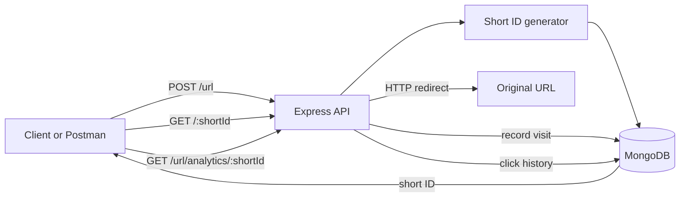

# URL SHORTNER

A lightweight URL-shortening REST API built with Node.js, Express, and MongoDB. The service creates short IDs for long URLs, redirects visitors, and records click history for analytics.

[](https://nodejs.org/)
[](https://expressjs.com/)
[](https://www.mongodb.com/)
[](https://opensource.org/licenses/ISC)

## Quick Navigation

- [What has been built](#what-has-been-built)
- [Technology and tools](#technology-and-tools)
- [How the API works](#how-the-api-works)
- [Project structure](#project-structure)
- [Run locally](#run-locally)
- [Test with Postman](#test-with-postman)
- [MongoDB data model](#mongodb-data-model)
- [Current scope](#current-scope)

## What has been built

| Area | Current implementation |
| --- | --- |
| Short URL creation | `POST /url` accepts a long URL and returns a generated short ID. |
| Redirection | `GET /:shortId` finds the saved URL, records a visit timestamp, and redirects to the original URL. |
| Click analytics | `GET /url/analytics/:shortId` returns total clicks and the recorded visit timestamps. |
| Persistence | MongoDB stores shortened URLs, destination URLs, visit history, and document timestamps. |
| API format | JSON request and response handling through Express. |

<details>
<summary>Request lifecycle</summary>



</details>

## Technology and tools

- **Node.js**: JavaScript runtime.
- **Express 5**: HTTP server and REST route handling.
- **MongoDB**: Database running locally at `mongodb://localhost:27017/short-url`.
- **Mongoose**: MongoDB connection and schema/model layer.
- **shortid**: Generates short URL identifiers.
- **Nodemon**: Restarts the development server when files change.
- **Postman**: Used to send requests to and verify the API during development.
- **Git and GitHub**: Source control and project hosting.

## How the API works

The server listens on port `8001`.

### Create a short URL

```http
POST http://localhost:8001/url
Content-Type: application/json
```

```json
{
  "url": "https://example.com/a-long-page"
}
```

Example response:

```json
{
  "id": "generated-short-id"
}
```

A missing `url` field returns `400 Bad Request`.

### Redirect through a short URL

```http
GET http://localhost:8001/generated-short-id
```

The API records the visit and redirects the client to the saved destination URL.

### Read analytics

```http
GET http://localhost:8001/url/analytics/generated-short-id
```

Example response:

```json
{
  "totalClicks": 2,
  "analytics": [
    { "timestamp": 1720000000000 },
    { "timestamp": 1720000010000 }
  ]
}
```

## Project structure

```text
SHORT-URL/
├── controllers/
│   └── url.js       # Create short URLs and return analytics
├── models/
│   └── url.js       # Mongoose URL schema and model
├── routes/
│   └── url.js       # /url API routes
├── connect.js        # MongoDB connection helper
├── index.js          # Express app, redirect route, and server startup
├── package.json      # Scripts and dependencies
├── package-lock.json # Locked dependency versions
└── .gitignore        # Local dependencies, secrets, and logs excluded from Git
```

## Run locally

### Prerequisites

- Node.js and npm
- MongoDB running locally
- Postman, optional but recommended for API testing

### Setup

```bash
git clone https://github.com/Tanmay007-okay/URL-SHORTNER.git
cd URL-SHORTNER
npm install
npm start
```

The API is available at `http://localhost:8001`.

> The application currently uses a hard-coded local MongoDB connection string. Start MongoDB before running the server.

## Test with Postman

1. Start MongoDB.
2. Run `npm start`.
3. Create a `POST` request to `http://localhost:8001/url`.
4. Select **Body > raw > JSON** and send a URL payload.
5. Copy the returned `id`.
6. Send `GET http://localhost:8001/{id}` to test redirection.
7. Send `GET http://localhost:8001/url/analytics/{id}` to inspect click history.

A Postman collection is not currently checked into this repository; the endpoints above are the current test contract.

## MongoDB data model

The `url` collection stores documents in this shape:

```json
{
  "shortId": "generated-short-id",
  "redirectURL": "https://example.com",
  "visitHistory": [
    { "timestamp": 1720000000000 }
  ],
  "createdAt": "2024-01-01T00:00:00.000Z",
  "updatedAt": "2024-01-01T00:00:00.000Z"
}
```

`shortId` is required and unique. `redirectURL` is required. Mongoose automatically manages `createdAt` and `updatedAt` because timestamps are enabled.

## Current scope

### Included

- Create shortened URLs.
- Redirect requests to the original destination.
- Track visit timestamps.
- Return total clicks and visit history.
- Persist data in MongoDB.

### Not included yet

- User accounts or authentication.
- Custom aliases chosen by users.
- URL expiration or deletion.
- Rate limiting and abuse protection.
- Production environment configuration.
- Automated tests and a checked-in Postman collection.

## Development notes

The `start` script runs the server through Nodemon:

```bash
npm start
```

The repository intentionally excludes `node_modules`, `.env` files, and package-manager logs through `.gitignore`.
